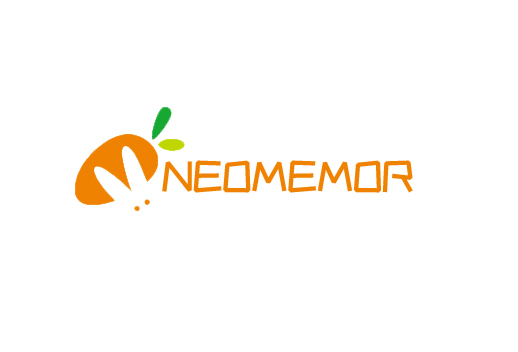

**NeoMemory软件需求说明书**

# 一、 概述

## 1、   编写目的

本说明书的目的在于明确NeoMemory软件功能模块需求，界定该软件的功能范围，指导软件的需求分析及软件架构开发说明。

本说明书预期读者为客户、项目经理、系统分析及系统设计人员、编码人员、测试经理、测试人员及系统维护人员等。

## 2、   系统简介

NeoMemory是一款帮助你记忆的程序。NeoMemory具有科学的学习方案，比传统的学习方法更为有效，甚至可以自定义你想需要的学习方案，因此你可以大幅减少花在学习上的时间，或是大幅提升学习量。

任何想要在日常生活中记忆事物的人都可受益于NeoMemory。NeoMemory采用的是（content-agnostic）模式，支持富文本、图像、音频 甚至代码等等内容，因此具有无限的可能性。例如：

- 学习一门语言
- 备考政治，历史，法律，医学等考试
- 作为简易备忘录
- 等等诸如此类需要背诵东西的场景

以卡片为基础，支持多样化的重复间隔【控制下一张卡片出现的时机】，允许你当倒数日，Tode List等不可思议的功能（视开发难度待定）。

实现重复记忆类功能 All in one

## 3、   系统功能范围
- 卡片以block为基础，一行文字、一张图片、一个视频、Todo列表、代码块、数学公式 等等都是 Block。这些 Block 可以轻松地进行“拖拽移动”、编辑、复制等操作
- 块状编辑区和无限级嵌套的卡片
- 高度可定制化的学习系统
  - 自定义选择不同的间隔学习算法【艾宾浩斯记忆曲线、SuperMemo算法等等】
  - 可自选需要学习的内容，或者随机推荐今日学习的内容，数量可自定义
- 强大的知识库管理（理论上应该和记忆程序分离成单独的系统）
  - 允许用户公开自己创建的知识库，可进行公开的团队协作和私人团队协作，类似于Git，当权限为public时，可以共享知识库内的卡片。可以与Git操作类似，或者与在线文档类APP类似，例如管理者可以对每位成员赋予不同的权限，如“只读”、“只读+评论”、“允许编辑”、“读写+分享”等不同的权限。

- 灵活的软件设置
  - 理想化情况下，应该使用插件模式的架构，实现难度大时，可参考策略模式
    - 允许用户扩展block的类型
    - 允许用户安装扩展
    - 允许用户改变软件主题，改变软件内block显示效果
    - 允许用户改变软件复习算法
    - 允许用户自定义卡片上的按钮按下的事件。
  - 软件数据备份恢复，理想化情况下能进行快速diff算法差异同步

## 4、   术语定义

**content-agnostic：** 不涉及物品本身的任何信息，也就是它是内容无关的

**Git的功能特性：**

> 从一般开发者的角度来看，git有以下功能：
>
> 1、从服务器上克隆完整的Git仓库（包括代码和版本信息）到单机上。
>
> 2、在自己的机器上根据不同的开发目的，创建分支，修改代码。
>
> 3、在单机上自己创建的分支上提交代码。
>
> 4、在单机上合并分支。
>
> 5、把服务器上最新版的代码fetch下来，然后跟自己的主分支合并。
>
> 6、生成补丁（patch），把补丁发送给主开发者。
>
> 7、看主开发者的反馈，如果主开发者发现两个一般开发者之间有冲突（他们之间可以合作解决的冲突），就会要求他们先解决冲突，然后再由其中一个人提交。如果主开发者可以自己解决，或者没有冲突，就通过。
>
> 8、一般开发者之间解决冲突的方法，开发者之间可以使用pull 命令解决冲突，解决完冲突之后再向主开发者提交补丁。

## 5、   运行环境

**软件环境**

Java虚拟机：JDK 17+

客户端操作系统：Windows macOS Linux Android IOS

客户端浏览器：Chrome 、 Firefox 、 Safari

 

**硬件环境**

根据实际情况，进行分析。

 

# 二、 软件概述

## 软件业务流程

## 系统架构

NeoMemory 采用微内核架构（Microkernel Architecture），有时也被称为插件化架构（Plug-in Architecture），是一种面向功能进行拆分的可扩展性架构，我们创造插件主要是帮助我们解决以下两种类型的问题：为系统提供全新的能力，对系统现有能力进行定制
微内核架构模式包括两种类型的架构组件：核心系统（Core System）和插件模块（Plug-in modules）。「应用逻辑被分割为独立的插件模块和核心系统，提供了可扩展性、灵活性、功能隔离和自定义处理逻辑的特性。」
微内核架构的本质就是将可能需要不断变化的部分封装在插件中，从而达到快速灵活扩展的目的，而又不影响整体系统的稳定。」
微内核架构的核心系统通常提供系统运行所需的最小功能集。许多操作系统使用的就是微内核架构，这也是它名字的由来。从商业应用程序的角度来看，核心系统一般是通用业务逻辑，没有特殊情况、特殊规则或复杂情形下的自定义代码。
插件模块是独立的模块，包含特定的处理、额外的功能和自定义代码，来向核心系统增强或扩展额外的业务能力。「通常插件模块之间也是独立的，也有一些插件是依赖于若干其它插件的。重要的是，尽量减少插件之间的通信以避免依赖的问题。」
### 微内核架构的优点

- 灵活性高：整体灵活性是对环境变化快速响应的能力。由于插件之间的低耦合，改变通常是隔离的，可以快速实现。通常，核心系统是稳定且快速的，具有一定的健壮性，几乎不需要修改。
- 可测试性：插件可以独立测试，也很容易被模拟，不需修改核心系统就可以演示或构建新特性的原型。
- 性能高：虽然微内核架构本身不会使应用高性能，但通常使用微内核架构构建的应用性能都还不错，因为可以自定义或者裁剪掉不需要的功能。
- [微内核架构 - 软件架构模式 [书籍] (oreilly.com)](https://www.oreilly.com/library/view/software-architecture-patterns/9781491971437/ch03.html)

## 系统主要功能框架图

图1.记忆片段录入基本流程图

图2.组建记忆宫殿基本流程图

图3.学习基本流程图

图4.插件安装基本流程图

# 三、 业务需求分析

##  核心功能

### 记忆

### 笔记

##  记忆模板创建

##  复习算法

superMemo2算法参考资料[SuperMemo.com](https://www.supermemo.com/en/archives1990-2015/english/ol/sm2)

##  插件系统

## 数据导入导出

## 用户信息处理

# 四、 需求规定

## 1、   一般规定

a)  系统应支持20000人以上同时在线使用。

b)  本系统对系统输入提供格式验证功能，防止非法格式数据进入系统。输出数据，在不影响其意义的情况下，按照一般系统的输出要求。在要求使用高精度数据的地方，系统要提供高精度数据的处理能力。不允许系统随意忽略数据的精度。

c)  本系统要求在文件上传下载时，如果文件较大需要时间较多，要有提示信息。

d)  本系统需对每个用户进行严格的权限管理。

e)  本系统应支持图片、视频、音频的显示。

f)  用户在进行删改操作时系统应有提示。

g)  每添加、修改、删除一个属性的操作步数不应超过3步。每次响应时间不应超过3秒，数据量较大时不应超过10秒且系统应当及时提示。

## 2、   灵活性

系统应保持功能的灵活性，预留接口代理函数

支持第三方系统的对接，如：OA系统，单点登录系统，第三方词典接口。

## 3、   健壮性

系统运行时，应该具有容错能力。系统出现时异常，应拦截异常，并提示用户异常信息，及处理异常方法。不影响及阻止用户下一步的操作。

## 4、   稳定性

系统遇到高承载情况时，应提示用户及系统管理员，系统满负荷运行，禁止登陆，同步数据，确保不影响其他登录用户的操作，或者导致用户同步失败造成的数据错乱。

## 5、   可维护性

系统应维护简单，方便，系统重装及恢复操作快捷。支持系统数据备份操作。
