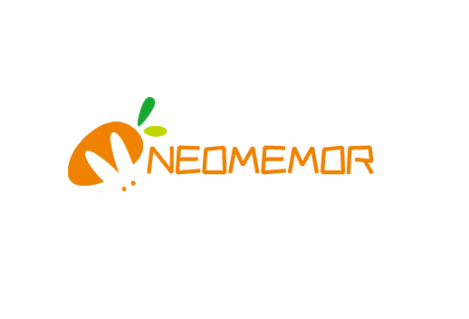

**NeoMemory软件需求说明书**

# 一、 概述

## 1、   编写目的

本说明书的目的在于明确NeoMemory软件功能模块需求，界定该软件的功能范围，指导软件的需求分析及软件架构开发说明。

本说明书预期读者为客户、项目经理、系统分析及系统设计人员、编码人员、测试经理、测试人员及系统维护人员等。

## 2、   系统简介

NeoMemory是一款帮助你记忆的程序。NeoMemory具有科学的学习方案，比传统的学习方法更为有效，甚至可以自定义你想需要的学习方案，因此你可以大幅减少花在学习上的时间，或是大幅提升学习量。

任何想要在日常生活中记忆事物的人都可受益于NeoMemory。NeoMemory采用的是（content-agnostic）模式，支持Markdown、图像、音频 甚至代码等等内容，因此具有无限的可能性。例如：

- 学习一门语言
- 备考政治，历史，法律，医学等考试
- 作为简易备忘录
- 等等诸如此类需要背诵东西的场景

## 3、   系统功能范围

- content-agnostic的记忆片段【允许用户自定义-需要提供可视化编辑器】
- 记忆宫殿(记忆片段的集合)
- 学习系统
    - 不同的记忆方式【主动回忆法、抄诵法等等】
    - 不同的抗遗忘策略【有官方默认算法，支持使用参数扩展】可以生成复习曲线概览
- 学习数据统计
- 软件设置
    - 插件模式的架构
        - 允许用户扩展记忆片段模板
        - 允许用户改变软件主题
        - 允许用户改变软件复习算法
    - 软件数据备份恢复

## 4、   术语定义

**content-agnostic：** 不涉及物品本身的任何信息，也就是它是内容无关的

**Markdown：** Markdown是一种轻量级标记语言，它允许人们使用易读易写的纯文本格式编写文档，然后转换成有效的HTML文档。
由于Markdown的轻量化、易读易写特性，并且对于图片，图表、数学式都有支持，许多网站都广泛使用Markdown来撰写帮助文档或是用于论坛上发表消息。 如GitHub、Reddit、简书等，甚至还能被使用来撰写电子书。

**主动回忆法：**

**练习题库：** 考生做模拟考试练习时使用的题库，与考试题库包含题目不同。

**考试题库：** 考生正式考试时使用的题库，与练习题库包含题目不同。

**管理人员：** 对系统维护和管理的操作员。

**考生：** 使用记忆系统进行考试的人员。

**学生：** 使用记忆系统进行学习的人员。

**客观题：** 答案严格唯一的题目。学生的回答只有对、错之分

**主观题：** 答案不唯一的题目。

**选择题：** 一种客观题。题目包括题干（对题目的描述)，选项（选项当中有一个或多个符合题目的要求），答案（即符合题干要求的选项的集合）。

**判断题：** 一种客观题。题目包括题干（一段描述描述)，答案。题目要求考生判断题干所描述的内容是否正确。

**填空题：** 一种主观题。题目包括题干、答案。其中题干中描述不全部分需要考生补全。

**名词解释：** 一种主观题。对指定的名词进行分析理解其含义。

**计算题：** 给定必要的计算数据，按照一定的公式，计算出需要的结果。

**科目：** 即考试课程的名称。

## 5、   运行环境

**软件环境**

Java虚拟机：JDK 17+

客户端操作系统：Windows macOS Linux Android IOS

客户端浏览器：Chrome 、 Firefox 、 Safari

**硬件环境**

根据实际情况，进行分析。

# 二、 软件概述

## 软件业务流程

## 系统架构

NeoMemory 采用微内核架构（Microkernel Architecture），有时也被称为插件化架构（Plug-in Architecture），是一种面向功能进行拆分的可扩展性架构，我们创造插件主要是帮助我们解决以下两种类型的问题：为系统提供全新的能力，对系统现有能力进行定制
微内核架构模式包括两种类型的架构组件：核心系统（Core System）和插件模块（Plug-in modules）。「应用逻辑被分割为独立的插件模块和核心系统，提供了可扩展性、灵活性、功能隔离和自定义处理逻辑的特性。」
微内核架构的本质就是将可能需要不断变化的部分封装在插件中，从而达到快速灵活扩展的目的，而又不影响整体系统的稳定。」
微内核架构的核心系统通常提供系统运行所需的最小功能集。许多操作系统使用的就是微内核架构，这也是它名字的由来。从商业应用程序的角度来看，核心系统一般是通用业务逻辑，没有特殊情况、特殊规则或复杂情形下的自定义代码。
插件模块是独立的模块，包含特定的处理、额外的功能和自定义代码，来向核心系统增强或扩展额外的业务能力。「通常插件模块之间也是独立的，也有一些插件是依赖于若干其它插件的。重要的是，尽量减少插件之间的通信以避免依赖的问题。」

### 微内核架构的优点

- 灵活性高：整体灵活性是对环境变化快速响应的能力。由于插件之间的低耦合，改变通常是隔离的，可以快速实现。通常，核心系统是稳定且快速的，具有一定的健壮性，几乎不需要修改。
- 可测试性：插件可以独立测试，也很容易被模拟，不需修改核心系统就可以演示或构建新特性的原型。
- 性能高：虽然微内核架构本身不会使应用高性能，但通常使用微内核架构构建的应用性能都还不错，因为可以自定义或者裁剪掉不需要的功能。
- [微内核架构 - 软件架构模式 [书籍] (oreilly.com)](https://www.oreilly.com/library/view/software-architecture-patterns/9781491971437/ch03.html)

## 系统主要功能框架图

图1.记忆片段录入基本流程图

图2.组建记忆宫殿基本流程图

图3.学习基本流程图

图4.插件安装基本流程图

# 三、 业务需求分析

##  核心功能

### 记忆

### 记忆片段

### 记忆宫殿

### 笔记

##  记忆模板创建

##  复习算法

##  插件系统

## 数据导入导出

## 用户信息处理

# 四、 需求规定

## 1、   一般规定

a)  系统应支持2000人以上同时在线使用。

b)  本系统对系统输入提供格式验证功能，防止非法格式数据进入系统。输出数据，在不影响其意义的情况下，按照一般系统的输出要求。在要求使用高精度数据的地方，系统要提供高精度数据的处理能力。不允许系统随意忽略数据的精度。

c)  本系统要求在文件上传下载时，如果文件较大需要时间较多，要有提示信息。

d)  本系统需对每个用户进行严格的权限管理。

e)  本系统应支持图片、视频、音频的显示。

f)  用户在进行删改操作时系统应有提示。

g)  每添加、修改、删除一个属性的操作步数不应超过3步。每次响应时间不应超过3秒，数据量较大时不应超过10秒且系统应当及时提示。

## 2、   灵活性

系统应保持功能的灵活性，预留接口代理函数

支持第三方系统的对接，如：OA系统，单点登录系统，第三方词典接口。

## 3、   健壮性

系统运行时，应该具有容错能力。系统出现时异常，应拦截异常，并提示用户异常信息，及处理异常方法。不影响及阻止用户下一步的操作。

## 4、   稳定性

系统遇到高承载情况时，应提示用户及系统管理员，系统满负荷运行，禁止登陆，同步数据，确保不影响其他登录用户的操作，或者导致用户同步失败造成的数据错乱。

## 5、   可维护性

系统应维护简单，方便，系统重装及恢复操作快捷。支持系统数据备份操作。
